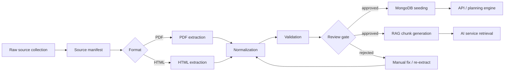
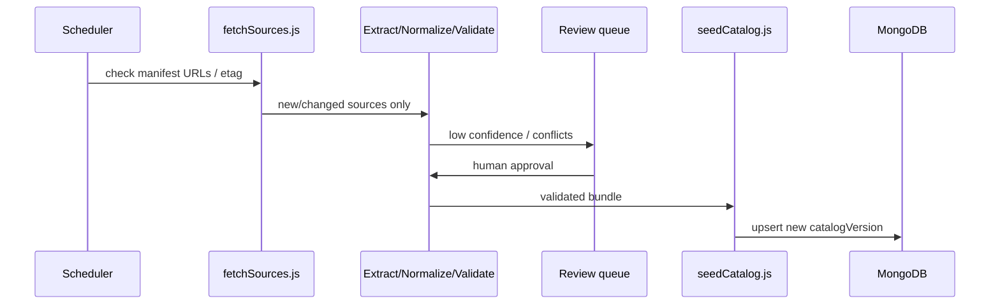

# UniPilot Technion Data Ingestion Architecture

Last updated: 2026-06-19  
Status: Design (pre-implementation)  
Related docs: `docs/PROJECT_CONTEXT.md`, `docs/DOMAIN_MODEL.md`, `docs/DATABASE_SCHEMA.md`, `docs/API_SPEC.md`

## 1) Purpose

This document defines how UniPilot AI ingests, validates, versions, and serves **Technion academic reference data** from heterogeneous public sources (PDFs, HTML pages, manually collected URLs, faculty pages, catalogs, degree requirement documents, and policy documents).

The design separates two concerns that must never be conflated:

| Concern | System of record | Used for |
|---|---|---|
| **Structured academic facts** | MongoDB (`degrees`, `courses`, `degree_requirements`, `course_offerings`, …) | Planning logic, eligibility checks, graduation progress, API responses |
| **Document-grounded explanations** | RAG index (derived from validated source text) | Policy explanations, narrative context, “why” answers with citations |

**Non-negotiable rule:** The LLM must **not invent** courses, prerequisites, credits, or degree requirements. All factual outputs must be grounded in MongoDB structured records and/or retrieved RAG chunks with provenance.

## 2) Scope and Phase Boundaries

### Phase 4 (near-term implementation)

Implement **only a small, curated seed dataset** for development and demos:

- Hand-authored or minimally transformed JSON under `data/validated/technion/<catalogYear>/`
- A single import path via `scripts/data/seedCatalog.js`
- Enough data to unblock student profile `degreeId` FK validation, catalog read APIs, and early AI grounding tests
- **No** automated PDF/HTML crawling, **no** full pipeline scripts in production use yet

### Later phase (full ingestion pipeline)

Implement the complete offline pipeline described in this document:

- Source collection and manifest management
- PDF/HTML extraction
- Normalization, validation, review, seeding, and RAG chunk generation
- Optional scheduled refresh workflow

The folder layout and script names below are **target architecture**; most scripts are stubs or future work until the later phase.

## 3) Technion Source Types

| Source type | Examples | Typical structured output | Typical RAG use |
|---|---|---|---|
| PDF course catalogs | Faculty course booklets, registration guides | `courses`, `course_offerings` (partial) | Descriptions, footnotes, registration notes |
| HTML course pages | `students.technion.ac.il`, faculty course sites | `courses` metadata, links | Syllabus narrative, policies per course |
| Manually collected URLs | Bookmarks, advisor-shared links | manifest entries only initially | n/a until extracted |
| Faculty/department pages | Degree landing pages, track descriptions | `degrees` metadata | Program overview text |
| Degree requirement documents | “תקנון לימודים”, track checklists (PDF/HTML) | `degree_requirements` | Requirement explanations, edge cases |
| Policy documents | Prerequisites policy, grade rules, overload policy | rarely structured; mostly RAG | Policy Q&A with citations |

Not every source yields reliable structured fields. The pipeline must tolerate **extraction confidence levels** and route low-confidence facts to manual review instead of MongoDB.

## 4) Repository Layout

```text
data/
  raw/                          # Immutable snapshots as collected
    technion/
      <catalogYear>/
        manifest.json             # Source manifest (see §5)
        pdfs/
        html/
        url-list.txt
  extracted/                    # Plain text / structured pre-normalization output
    technion/
      <catalogYear>/
        pdfs/
        html/
        metadata.json
  normalized/                   # Schema-shaped JSON, pre-validation
    technion/
      <catalogYear>/
        degrees.json
        courses.json
        degree_requirements.json
        course_offerings.json
        policies.json             # Mostly RAG-oriented policy snippets
  validated/                    # Passes validateCatalog.js; ready to seed
    technion/
      <catalogYear>/
        catalog.bundle.json         # Optional single bundle for seeding
        degrees.json
        courses.json
        degree_requirements.json
        course_offerings.json
  rag/                          # Chunk files for vector index build
    technion/
      <catalogYear>/
        chunks.jsonl
        index-manifest.json
  reports/                      # Validation, review, and run logs
    technion/
      <catalogYear>/
        validation-report.json
        review-queue.json
        ingestion-run-<timestamp>.json

scripts/data/
  fetchSources.js               # Download URLs / snapshot PDFs & HTML (later phase)
  extractPdfText.js             # PDF -> extracted text + layout hints (later phase)
  extractHtmlText.js            # HTML -> extracted text + DOM metadata (later phase)
  normalizeCourses.js           # extracted -> normalized courses (+offerings)
  normalizeRequirements.js      # extracted -> normalized degrees/requirements
  validateCatalog.js            # normalized -> validated + reports/*
  seedCatalog.js                # validated -> MongoDB (Phase 4: primary script)
```

### Git policy

| Path | Commit to git? | Notes |
|---|---|---|
| `data/validated/technion/<year>/` (curated seed) | Yes (small) | Phase 4 demo dataset only |
| `data/raw/`, `data/extracted/`, large PDFs | No | Add to `.gitignore`; store checksums in manifest |
| `data/reports/` | Optional | Commit summary reports only, not large logs |
| `data/rag/` chunks | Optional | Prefer rebuilding from validated sources |

## 5) Pipeline Overview



Each stage is **idempotent** and writes artifacts to disk before the next stage mutates downstream state. MongoDB is updated only from `data/validated/` via `seedCatalog.js`.

---

## 6) Stage 1 — Raw Source Collection

**Goal:** Capture immutable evidence of what was ingested and when.

**Inputs:**

- Manually curated URL lists (`data/raw/technion/<catalogYear>/url-list.txt`)
- Downloaded PDFs (course catalogs, degree booklets, policy PDFs)
- Saved HTML snapshots (wget/single-file or fetch script output)
- Faculty/department pages and course catalog pages

**Rules:**

- Treat `data/raw/` as **append-only** per catalog version. Never overwrite without a new `sourceId`.
- Store fetch timestamp, original URL, HTTP status, content type, and SHA-256 checksum for every artifact.
- Respect Technion terms of use and robots constraints; default to **manual URL list + throttled fetch** rather than unbounded crawling.

**Phase 4:** Team manually places a tiny curated set (or skips raw entirely and authors `data/validated/` directly).

---

## 7) Stage 2 — Source Manifest

**Goal:** Machine-readable index of all raw inputs and their intended downstream mapping.

**Location:** `data/raw/technion/<catalogYear>/manifest.json`

**Example shape:**

```json
{
  "institutionId": "technion",
  "catalogYear": 2025,
  "catalogVersion": "2025.1",
  "collectedAt": "2026-06-19T10:00:00.000Z",
  "sources": [
    {
      "sourceId": "src-2025-cs-catalog-pdf",
      "type": "pdf",
      "title": "CS Undergraduate Course Catalog 2025",
      "url": "https://example.technion.ac.il/...",
      "localPath": "pdfs/cs-catalog-2025.pdf",
      "sha256": "...",
      "faculty": "CS",
      "documentClass": "course_catalog",
      "language": "he",
      "priority": 1
    },
    {
      "sourceId": "src-2025-cs-degree-req-html",
      "type": "html",
      "title": "BSc CS Degree Requirements",
      "url": "https://example.technion.ac.il/...",
      "localPath": "html/cs-degree-reqs.html",
      "sha256": "...",
      "faculty": "CS",
      "documentClass": "degree_requirements",
      "language": "he",
      "priority": 1
    }
  ]
}
```

**`documentClass` values (initial enum):**

- `course_catalog`
- `course_page`
- `degree_requirements`
- `faculty_page`
- `policy`
- `other`

The manifest drives which normalizer runs and how `sourceRefs` are attached later.

---

## 8) Stage 3 — PDF Extraction

**Script:** `scripts/data/extractPdfText.js` (later phase)

**Goal:** Convert PDFs to searchable text while preserving page anchors for provenance.

**Output:** `data/extracted/technion/<catalogYear>/pdfs/<sourceId>.json`

```json
{
  "sourceId": "src-2025-cs-catalog-pdf",
  "extractor": "pdf-parse",
  "extractorVersion": "1.0.0",
  "pages": [
    { "page": 1, "text": "..." }
  ],
  "warnings": ["scanned_page_low_confidence:12"]
}
```

**Design notes:**

- Prefer text-based PDF parsing first; OCR is a fallback and marks lower confidence.
- Do not structure here; extraction output is **text + anchors only**.
- Hebrew/English mixed documents must retain original text; normalization handles bilingual field mapping later.

---

## 9) Stage 4 — HTML Extraction

**Script:** `scripts/data/extractHtmlText.js` (later phase)

**Goal:** Extract main content from Technion web pages without navigation boilerplate.

**Output:** `data/extracted/technion/<catalogYear>/html/<sourceId>.json`

```json
{
  "sourceId": "src-2025-cs-degree-req-html",
  "url": "https://...",
  "title": "...",
  "extractedAt": "2026-06-19T10:05:00.000Z",
  "contentText": "...",
  "headings": [
    { "level": 2, "text": "מבנה התואר" }
  ],
  "tables": [],
  "links": [],
  "warnings": []
}
```

**Design notes:**

- Use readability-style main-content selection; strip headers/footers/menus.
- Preserve heading hierarchy for chunk boundaries in RAG.
- Table extraction is best-effort; critical requirement tables may require manual normalization.

---

## 10) Stage 5 — Normalization into Structured JSON

**Scripts:**

- `scripts/data/normalizeCourses.js`
- `scripts/data/normalizeRequirements.js`

**Goal:** Map extracted text into **intermediate JSON** aligned with `docs/DATABASE_SCHEMA.md`, without yet asserting database truth.

**Output:** `data/normalized/technion/<catalogYear>/*.json`

### Required fields on every normalized catalog record

| Field | Description |
|---|---|
| `institutionId` | Always `"technion"` for this pipeline |
| `catalogYear` | Academic catalog year (e.g. `2025`) |
| `catalogVersion` | Semver-like tag (e.g. `"2025.1"`) bumped on corrections |
| `sourceRefs` | Array of provenance objects (see §15) |
| `confidence` | `high` \| `medium` \| `low` |
| `status` | `draft` until validated |

### Course normalization (target document shape)

Maps to MongoDB `courses` collection:

```json
{
  "institutionId": "technion",
  "subject": "02360363",
  "number": "02360363",
  "title": "Introduction to Machine Learning",
  "credits": 3,
  "description": "...",
  "prerequisites": [],
  "catalogYear": 2025,
  "catalogVersion": "2025.1",
  "version": "2025.1",
  "status": "draft",
  "confidence": "medium",
  "sourceRefs": [
    {
      "sourceId": "src-2025-cs-catalog-pdf",
      "locator": "page:42",
      "quote": "..."
    }
  ]
}
```

Prerequisite edges are stored as **course identifiers** during normalization, then resolved to ObjectIds during validation/seeding.

### Degree / requirement normalization

Maps to `degrees` and `degree_requirements`:

- Degree: `code`, `name`, `version`, `effectiveFrom`, `effectiveTo`, `metadata`
- Requirements: `requirementType`, `ruleExpression`, `minCredits`, `courseSet`, `priority`, `isMandatory`

**LLM-assisted normalization (later phase, optional):**

- Allowed only to **propose** structured fields from extracted text.
- Proposals must include `sourceRefs` and `confidence`.
- Nothing writes to `data/validated/` without passing `validateCatalog.js` and review gates.

---

## 11) Stage 6 — Validation

**Script:** `scripts/data/validateCatalog.js`

**Goal:** Enforce schema, referential integrity, and institution rules before MongoDB import.

**Input:** `data/normalized/technion/<catalogYear>/`  
**Output:** `data/validated/technion/<catalogYear>/` + `data/reports/technion/<catalogYear>/validation-report.json`

### Validation checks

| Check | Failure action |
|---|---|
| JSON schema conformance (per entity) | reject record |
| Required `catalogYear`, `catalogVersion`, `sourceRefs` | reject record |
| Unique course keys `(institutionId, subject, number, version)` | reject duplicate |
| Unique degree keys `(institutionId, code, version)` | reject duplicate |
| Prerequisite references resolve to known courses | reject or queue review |
| Credits within Technion-accepted bounds | reject or queue review |
| `confidence: low` on structured fact fields | queue manual review |
| Conflicting values for same course across sources | queue manual review |

Validated records receive `status: "approved"` (or `status: "published"` at seed time).

---

## 12) Stage 7 — MongoDB Seeding / Import

**Script:** `scripts/data/seedCatalog.js`

**Goal:** Upsert validated catalog documents into MongoDB collections.

**Source of truth rule:** After seeding, **MongoDB is authoritative** for structured academic data consumed by the API, graduation engine, and AI fact lookup. File artifacts remain audit evidence, not runtime truth.

### Target collections

| Collection | Seed mode |
|---|---|
| `degrees` | upsert by `(institutionId, code, version)` |
| `courses` | upsert by `(institutionId, subject, number, version)` |
| `degree_requirements` | upsert by `(degreeId, version, requirementType, priority)` or stable requirement key |
| `course_offerings` | upsert by `(courseId, semesterCode, section)` |

### Seeding rules

- Import only from `data/validated/`.
- Attach `sourceRefs`, `catalogYear`, and `catalogVersion` on every catalog document (stored in `metadata` or first-class fields per `DATABASE_SCHEMA.md` update).
- Never delete student-owned data during catalog refresh.
- Catalog refresh creates a **new `catalogVersion`**; old versions remain queryable for students pinned to prior catalogs.

### Phase 4 behavior

- Seed a **small curated** Technion subset (e.g. one degree track, 10–30 courses, minimal requirements).
- Run manually: `node scripts/data/seedCatalog.js --institution technion --catalogYear 2025`
- Docker: seed step runs as a documented one-off admin command, **not** on every `docker compose up` (keeps first-run deterministic with bundled seed optional via env flag later).

---

## 13) Stage 8 — RAG Chunk Generation

**Goal:** Build retrieval chunks for explanations and policies **without** replacing MongoDB facts.

**Output:** `data/rag/technion/<catalogYear>/chunks.jsonl`

**Chunk sources:**

- Policy PDFs/HTML (primary RAG use case)
- Degree requirement narrative sections
- Course descriptions and syllabus text
- Faculty pages (program overview)

**Chunk record shape:**

```json
{
  "chunkId": "chk-src-2025-policy-overload-p3-001",
  "institutionId": "technion",
  "catalogYear": 2025,
  "catalogVersion": "2025.1",
  "documentClass": "policy",
  "sourceRefs": [
    {
      "sourceId": "src-2025-overload-policy-pdf",
      "locator": "page:3",
      "url": "https://..."
    }
  ],
  "text": "...",
  "language": "he",
  "embeddingModel": null
}
```

### RAG vs MongoDB boundary

| Question type | Answer source |
|---|---|
| “How many credits is course 02360363?” | MongoDB `courses` only |
| “What are the prerequisites for 02360363?” | MongoDB `courses.prerequisites` only |
| “What is the overload credit policy?” | RAG retrieval + cited chunks |
| “Explain why this requirement exists” | RAG + structured requirement metadata |

The AI service must fetch structured facts from MongoDB (or API) and use RAG only for supplemental narrative with citations.

---

## 14) Stage 9 — Provenance / Source Tracking

Every structured catalog record and RAG chunk carries `sourceRefs`:

```json
{
  "sourceId": "src-2025-cs-catalog-pdf",
  "url": "https://...",
  "localPath": "data/raw/technion/2025/pdfs/cs-catalog-2025.pdf",
  "locator": "page:42",
  "quote": "optional short excerpt",
  "retrievedAt": "2026-06-19T10:00:00.000Z",
  "sha256": "..."
}
```

**Runtime usage:**

- API catalog responses may expose `sourceRefs` on admin/debug endpoints; student-facing responses can omit quotes but should retain `catalogVersion`.
- AI responses must include citation metadata pointing to `sourceId` + `locator` when using RAG text.
- Disputes (“this prerequisite is wrong”) are resolved by updating normalized data, re-validating, bumping `catalogVersion`, and re-seeding — not by editing MongoDB ad hoc.

---

## 15) Stage 10 — Catalog Versioning

**Version dimensions:**

| Field | Meaning |
|---|---|
| `catalogYear` | Academic catalog year (student-facing selector) |
| `catalogVersion` | Ingestion publish tag (`2025.1`, `2025.2`, …) |
| Entity `version` | Per-document version aligned with `catalogVersion` |

**Rules:**

- `student_profiles.catalogYear` pins a student to a catalog year; `degreeId` references a specific degree version.
- Corrections within a year bump `catalogVersion` (e.g. fixed prerequisite).
- Breaking changes require new `catalogYear`.
- API read endpoints default to active published version for a `catalogYear` unless a specific version is requested (admin).

---

## 16) Stage 11 — Manual Review Workflow

**Goal:** Human approval gate before low-confidence or conflicting data reaches MongoDB.

**Queue file:** `data/reports/technion/<catalogYear>/review-queue.json`

**Queue entry reasons:**

- `low_confidence`
- `conflicting_sources`
- `unresolved_prerequisite`
- `ocr_fallback`
- `missing_credits`

**Workflow:**

1. `validateCatalog.js` emits review items instead of promoting bad records.
2. Reviewer edits `data/normalized/` (or a sidecar override file) and re-runs validation.
3. Approved items move to `data/validated/`.
4. Summary logged in `ingestion-run-<timestamp>.json`.

**Phase 4:** Manual review is informal (team edits curated JSON directly).

---

## 17) Stage 12 — Future Automated Refresh Workflow

**Goal:** Periodically detect stale sources and re-run the pipeline (later phase).



**Policies:**

- Refresh is **offline**; never blocks API request path.
- New `catalogVersion` is published explicitly; students are not silently migrated.
- Failed refresh leaves prior `catalogVersion` active.
- Fetch throttling and checksum comparison prevent redundant work.

---

## 18) Script Responsibilities

| Script | Phase | Responsibility |
|---|---|---|
| `fetchSources.js` | Later | Download URLs from manifest; verify checksums; update manifest |
| `extractPdfText.js` | Later | PDF → `data/extracted/.../pdfs/` |
| `extractHtmlText.js` | Later | HTML → `data/extracted/.../html/` |
| `normalizeCourses.js` | Later | Extracted text → `courses` / `course_offerings` normalized JSON |
| `normalizeRequirements.js` | Later | Extracted text → `degrees` / `degree_requirements` normalized JSON |
| `validateCatalog.js` | Later (Phase 4 minimal version optional) | Normalized → validated + reports |
| `seedCatalog.js` | **Phase 4** | Validated → MongoDB upsert |

All scripts accept `--institution technion --catalogYear <year>` and log to `data/reports/`.

---

## 19) Integration with UniPilot Services

```text
┌─────────────────────────────────────────────────────────────┐
│ Offline ingestion (scripts/data/*, data/*)                  │
│  raw → extracted → normalized → validated → seedCatalog.js   │
└───────────────────────────┬─────────────────────────────────┘
                            │ upsert
                            ▼
┌─────────────────────────────────────────────────────────────┐
│ MongoDB (source of truth)                                    │
│  degrees | courses | degree_requirements | course_offerings  │
└───────────────┬─────────────────────────────┬───────────────┘
                │ read                         │ read
                ▼                              ▼
┌───────────────────────────┐    ┌────────────────────────────┐
│ API (catalog endpoints)    │    │ AI service                  │
│ deterministic responses    │    │ facts from MongoDB          │
└───────────────────────────┘    │ explanations from RAG chunks  │
                                 └────────────────────────────┘
```

- **API** serves catalog data read-only to authenticated students.
- **Worker + AI** use MongoDB for factual grounding; RAG index built from `data/rag/` is loaded by the AI service internally.
- Ingestion scripts run **outside** the request path (developer machine or CI job), not inside the `api` container at runtime.

---

## 20) Phase 4 Deliverable Checklist (Small Curated Seed Only)

- [ ] Create `data/validated/technion/2025/` with curated `degrees.json`, `courses.json`, `degree_requirements.json`
- [ ] Implement `scripts/data/seedCatalog.js` (idempotent upsert)
- [ ] Every seeded record includes `sourceRefs`, `catalogYear`, `catalogVersion`
- [ ] Enable `student_profiles.degreeId` FK validation against seeded `degrees`
- [ ] Document seed command in `README.md`
- [ ] Defer `fetchSources`, PDF/HTML extractors, and automated normalizers to later phase

---

## 21) Risks and Mitigations

| Risk | Mitigation |
|---|---|
| LLM hallucinates catalog facts | Facts only from MongoDB; RAG for narrative; validate AI output against DB |
| Hebrew PDF extraction quality | Confidence scoring + manual review queue |
| Technion site structure changes | Manifest-driven URLs; versioned snapshots in `data/raw/` |
| Stale catalog harms planning | `catalogVersion` on records; student `catalogYear` pinning |
| Legal/terms constraints on crawling | Manual URL curation; throttled fetch; store evidence in manifest |
| Large binaries in git | `.gitignore` for `data/raw/`; commit validated JSON only |

---

## 22) Open Decisions (for ADR before implementation)

1. Whether `catalogVersion` is a first-class field on all catalog collections or nested under `metadata`.
2. Vector store location for RAG (embedded in AI service vs external DB).
3. Whether Phase 4 bundles seed data automatically in Docker or via documented manual seed step.
4. OCR provider selection for scanned Technion PDFs.

These do not block Phase 4 curated seeding.
