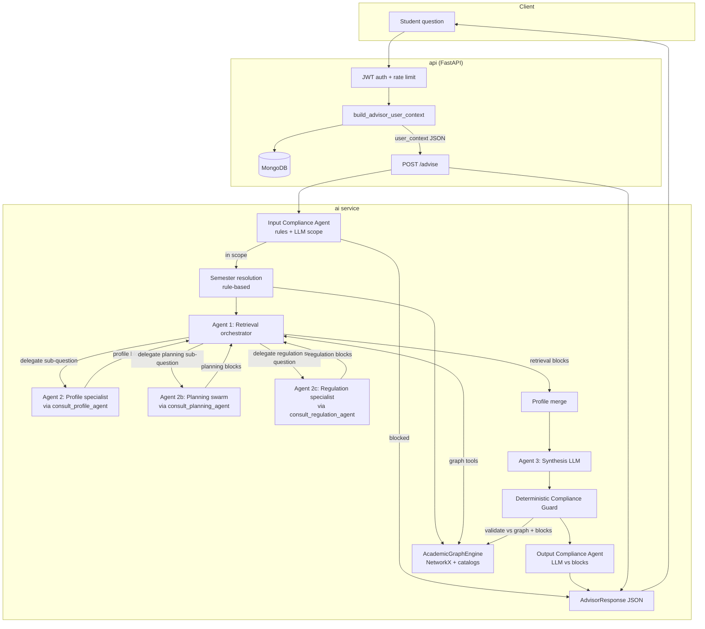

# UniPilot Advisor — Multi-Agent Architecture

Last updated: 2026-07-02

This document is the **living architecture plot** for the academic advisor stack. Update it whenever agent boundaries, tools, or data flow change.

Related: `docs/architecture/ARCHITECTURE.md` (platform containers), `docs/planning/AGENT_FEATURES_ROADMAP.md` (future agent features), `services/ai/app/services/advisor_agent.py`, `services/ai/app/services/profile_agent.py`, `services/ai/app/services/planning_agent.py`, `services/ai/app/services/regulation_agent.py`, `services/ai/app/services/compliance_guard.py`, `services/ai/app/services/input_compliance_agent.py`, `services/ai/app/services/output_compliance_agent.py`.

## Design goals

- **Preserve the original 3-stage pipeline** — semester resolution → retrieval orchestrator → synthesis.
- **Demonstrate multiple agents** — the retrieval orchestrator delegates student-specific work to a **Profile sub-agent** via `consult_profile_agent`, planning questions to a **Planning swarm** via `consult_planning_agent`, and policy/rights questions to a **Regulation specialist** via `consult_regulation_agent`.
- **MongoDB stays in the API** — the AI service receives a serialized profile envelope; it does not connect to MongoDB directly.

## High-level flow



## Agent responsibilities

| Stage | Component | Type | Responsibility |
|-------|-----------|------|----------------|
| Pre-agent | `resolve_semester_from_query` | Deterministic | Pick active semester JSON from question + profile defaults |
| Agent 1 | Retrieval orchestrator | LLM + tools | Gather wiki + semester catalog facts; delegate student-specific sub-questions |
| Agent 2 | Profile specialist | LLM + tools | Summarize transcript, academic path, assess course fit vs completed courses |
| Agent 2b | Planning swarm | LLM + tools | Graduation progress, latest semester plan, latest risk analysis (API snapshots) |
| Agent 2c | Regulation specialist | LLM + tools | Wiki policy search, mandatory slug citations, suggested contacts |
| Merge | `_merge_user_profile` | Deterministic | Attach profile envelope for synthesis |
| Agent 3 | Synthesis | LLM structured output | Natural-language answer from blocks + profile |
| Post | Compliance Guard (deterministic) | Deterministic | Verify eligibility, credits, course IDs vs graph + blocks |
| Post | Output Compliance Agent | LLM + blocks | Semantic claim verification; remediate on failure |
| Pre | Input Compliance Agent | Rules + LLM | Block homework/code/general misuse before retrieval |

## Agent 1 — Retrieval orchestrator tools

| Tool | Target |
|------|--------|
| `retrieve_graph_data` | Wiki + semester JSON (schedule, syllabus, prerequisites, …) |
| `list_wiki_catalog` / `list_semester_catalogs` | Browse sources |
| `select_semester_catalog` | Switch active semester file |
| **`consult_profile_agent`** | **Delegate to Agent 2** (student transcript, eligibility, path) |
| **`consult_planning_agent`** | **Delegate to Planning swarm** (progress, plan, risk snapshots) |
| **`consult_regulation_agent`** | **Delegate to Regulation specialist** (appeals, ombudsman, leave, student rights) |
| `finish_retrieval` | Stop loop (`ok` / `not_found`) |

## Agent 2 — Profile specialist tools

Operates on the **profile envelope** passed from the API (in-memory; no DB calls).

| Tool | Purpose |
|------|---------|
| `get_profile_summary` | Track, faculty, catalog year, current semester, completed count |
| `list_completed_courses` | Transcript slice (course numbers, grades, semesters) |
| `assess_course_fit` | Prerequisites eligibility via `AcademicGraphEngine.evaluate_eligibility` |
| `finish_profile_retrieval` | Return profile blocks to Agent 1 |

## Agent 2b — Planning swarm tools

Operates on **`planning_context`** pre-built by the API (`build_planning_context_envelope`) from graduation progress, latest semester plan, and latest risk analysis. No live MongoDB or planner calls inside the AI service.

| Tool | Purpose |
|------|---------|
| `get_graduation_progress_snapshot` | Credits earned/required, completion %, top missing requirements |
| `get_latest_semester_plan` | Latest stored plan courses and semester code |
| `get_latest_risk_analysis` | Highest severity and top risks |
| `finish_planning_retrieval` | Return planning blocks to Agent 1 |

## Agent 2c — Regulation specialist tools

Operates on the **wiki graph** via `AcademicGraphEngine` (no MongoDB). Policy-heavy questions are separated from catalog/schedule retrieval.

| Tool | Purpose |
|------|---------|
| `wiki_search` | Find regulation pages by keywords |
| `wiki_page` | Load full wiki policy text by slug |
| `cite_sources` | Record mandatory wiki slugs for synthesis citations |
| `suggested_contacts` | Ombudsman, dean of students, faculty studies office, etc. |
| `finish_regulation_retrieval` | Return regulation blocks to Agent 1 |

## Data boundaries

```
MongoDB (API only)
  student_profiles  ──┐
  completed_courses ──┼──► build_advisor_user_context() ──► user_context JSON
  courses (numbers)   ──┤
  semester_plans      ──┤
  academic_risks      ──┘
        │
        └──► build_planning_context_envelope() ──► planning_context JSON
                              │
                              ▼
                    AI UserContext / Profile + Planning envelope
                              │
              ┌───────────────┴───────────────┐
              ▼                               ▼
     Profile + Planning agent tools    Graph engine tools
```

## Response envelope (`POST /advise` internal / `POST /advisor/ask` public)

| Field | Description |
|-------|-------------|
| `semester_resolution` / `semesterResolution` | Resolved semester + confidence |
| `retrieval_agent` / `retrievalStatus` | Orchestrator status (public always gets status; full steps only with trace) |
| `profile_agent_invocations` / `agentTrace.profileAgentInvocations` | Profile sub-agent runs (opt-in on public API) |
| `planning_agent_invocations` / `agentTrace.planningAgentInvocations` | Planning swarm runs (opt-in on public API) |
| `regulation_agent_invocations` / `agentTrace.regulationAgentInvocations` | Regulation specialist runs (opt-in on public API) |
| `retrieval_blocks` / `agentTrace.retrievalBlocks` | Merged wiki / semester / profile / planning / regulation blocks (opt-in on public API) |
| `input_compliance` / `agentTrace.inputCompliance` | Pre-retrieval scope classification (opt-in on public API) |
| `compliance_guard` / `agentTrace.complianceGuard` | Deterministic post-synthesis verification (opt-in on public API) |
| `output_compliance` / `agentTrace.outputCompliance` | LLM semantic verification vs blocks (opt-in on public API) |
| `user_profile` | Profile merge snapshot (internal `/advise` only) |
| `response` / `answer` | Final advisor reply |

Public API: pass `include_agent_trace: true` on `POST /advisor/ask` to include `data.advisor.agentTrace`. Default `false` — answer only.

## Async AI jobs (AGT-1)

```
Client → POST /ai/jobs (JWT, rate limit) → MongoDB ai_jobs (pending) + Redis LPUSH
Worker → BRPOP → POST /internal/ai-jobs/{id}/process (internal token)
API handler → advisor_deep_plan → ask_advisor_for_user → completed/failed
Client → GET /ai/jobs/{id} (poll)
```

Web: Advisor page auto-polls when `POST /advisor/ask` returns **202** (`asyncAccepted: true`). Optional **Prefer instant answer** sends `execution_mode: sync`.

| Job type | Handler |
|----------|---------|
| `advisor_deep_plan` | Full advisor pipeline (same as `/advisor/ask`, async) |
| `simulation_run` | What-if simulation council run |
| `watchdog_scan` | Proactive nudges (pace / prereq / risk) → `ai_recommendations` |

## Proactive Watchdog (AGT-8)

Runs on the **worker** (not the request thread). Triggers enqueue a `watchdog_scan` job:

| Trigger | Hook |
|---------|------|
| Profile / transcript / completed courses change | `maybe_enqueue_watchdog_scan(..., profile_change)` |
| New semester plan | `maybe_enqueue_watchdog_scan(..., new_plan, planId)` |
| Weekly cron | Worker `WATCHDOG_WEEKLY_SCAN_ENABLED=true` → `POST /internal/watchdog/weekly-scan` |

**Checks (deterministic):** credits behind matrix pace, unmet prerequisites on latest plan, open high-severity academic risks.

**Delivery:** MongoDB `ai_recommendations` + log-only email stub. Public API: `GET /ai/recommendations`, `POST /ai/recommendations/{id}/dismiss`.

## Compliance Guard (AGT-9)

Three-layer compliance runs around every advisor answer:

| Phase | Component | Type |
|-------|-----------|------|
| **Input** | `input_compliance_agent` | Rules + LLM scope classifier |
| **Output (facts)** | `compliance_guard` | Deterministic graph/progress verifier |
| **Output (semantics)** | `output_compliance_agent` | LLM claim verifier vs `retrieval_blocks` |

**Input guard** blocks homework, code generation, essay writing, and prompt abuse before retrieval runs. Returns a scope refusal with `retrieval_agent.status = scope_blocked`.

**Deterministic guard** validates eligibility (`evaluate_eligibility`), credits/completion %, catalog course IDs, and block contradictions.

**LLM output guard** flags unsupported factual claims in the synthesized answer; on failure downgrades confidence and appends a semantic disclaimer.

Expose in `agentTrace` when `include_agent_trace: true`:

- `inputCompliance` — `{ status, category, reason, method, blocked }`
- `complianceGuard` — deterministic issues/remediations
- `outputCompliance` — `{ status, unsupportedClaims, reasoning, remediations }`

## Conversation history (summarized)

Raw chat turns are **not** stored. After each successful `/advisor/ask`, the API calls the AI service `POST /summarize-conversation` to merge the new exchange into a rolling summary.

| Collection | `advisor_conversations` |
|------------|----------------------|
| Ownership | `userId` |
| Stored fields | `title`, `summary`, `exchangeCount`, `lastConfidence`, timestamps |
| Public routes | `GET /advisor/conversations`, `GET /advisor/conversations/{id}`, `DELETE ...`, `POST /advisor/ask` with optional `conversation_id` |

## Change log

| Date | Change |
|------|--------|
| 2026-07-04 | AGT-9 v2: input scope guard (rules+LLM) + LLM output verifier layered on deterministic guard |
| 2026-07-04 | AGT-9 Compliance Guard: post-synthesis verifier for eligibility, credits, catalog IDs |
| 2026-07-02 | Auto-offload: `execution_mode` on `/advisor/ask` + heuristic classifier → 202 + job poll |
| 2026-07-02 | AGT-2 Planning swarm: `consult_planning_agent` + API `planning_context` envelope; Advisor async job UI |
| 2026-06-28 | Advisor conversation history: MongoDB `advisor_conversations` stores LLM rolling summaries only (no raw turns) |
| 2026-06-28 | Optional `include_agent_trace` on `POST /advisor/ask` — returns `agentTrace` only when requested |
| 2026-06-28 | Initial diagram: 3-stage pipeline + Profile sub-agent via `consult_profile_agent` |
