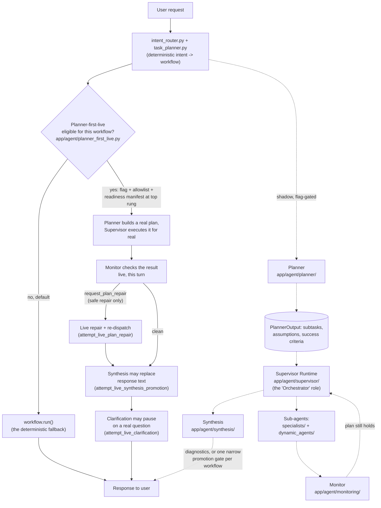
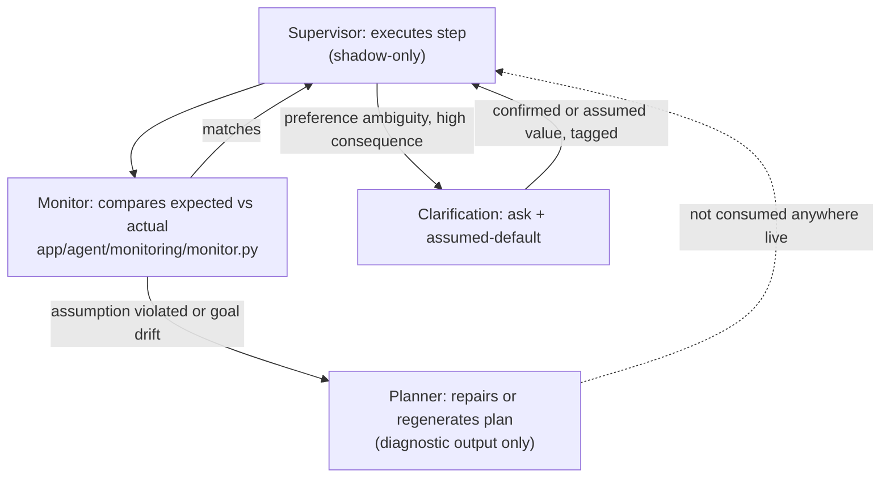
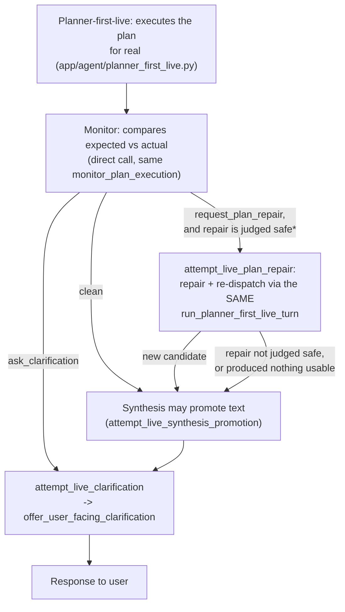

# Multi-Agent Orchestration — Architecture Notes

> **Status note (2026-07-07, updated post-Phase-9):** This document originated as a conceptual
> design (roles, contracts, information flow — no code). Every role it describes now has a
> corresponding, tested implementation in `services/agent/app/agent/`. This revision keeps the
> original narrative but adds a concrete **Status** block to every section: what's implemented,
> whether it's live (affects what the user sees), Planner-first-live (real execution, gated
> per-capability behind an explicit manifest approval), or shadow-only (diagnostic, flag-gated,
> off by default), and the file(s) to read for the real contract. See
> [`docs/agent/CURRENT_STATE.md`](../agent/CURRENT_STATE.md) for the exhaustive phase-by-phase
> reference and [`docs/agent_architecture_gap_tracker.md`](../agent_architecture_gap_tracker.md)
> for the fix/gap log this revision folds in.
>
> **Post-Phase-9 update:** the biggest gap this document originally flagged — §8's "the sensing
> loop is closed, but the action loop is not" — has since been closed for a specific, narrow,
> explicitly-gated set of capabilities. See `app/agent/planner_first_live.py` and the "Status
> (post-Phase-9)" paragraphs added throughout §§2–9. The shadow layer described below is
> unchanged and still exists in full; what's new is a *third* layer sitting between "live" and
> "shadow" — real execution of the Planner's own plan, per-capability opt-in, still off by
> default everywhere.

## 1. Purpose & scope

This document describes the conceptual architecture for a multi-agent system built around five cooperating roles: a **Planner**, an **Orchestrator**, a population of **dynamically constructed sub-agents**, a **Synthesis / Final Answer Composer**, and a **clarification mechanism** that lets the system defer genuinely ambiguous decisions to the user instead of guessing.

**What changed since the original version:** the system was built in two layers rather than one, and a third layer has since been added between them.

- **The live layer** is the deterministic fallback every capability still has. A deliberately
  simple pipeline: classify intent → map to one fixed workflow → run that workflow → compose a
  response. See `app/agent/orchestrator.py::run_agent_turn`. Still exactly what runs for any
  capability that hasn't been explicitly promoted (see below).
- **The Planner-first-live layer (post-Phase-9)** is real execution of the Planner's own plan,
  through the same Supervisor engine the shadow layer uses, standing in for the deterministic
  pipeline entirely for a turn — not just comparing against it. Gated per-capability, off by
  default, and deliberately narrower/stricter than the promotion gate below: it never bypasses
  its own readiness-manifest check even when that check is globally disabled. See
  `app/agent/planner_first_live.py` and §§2, 3, 5, 6, 7, 8 below.
- **The shadow layer** is a full, tested implementation of everything else this document
  describes — Planner, Supervisor (the "Orchestrator" role), dynamic sub-agents, Synthesis,
  Clarification, Monitor — running *in addition to* the live layer on every turn when its
  feature flags are on. Every flag defaults to `False`. It produces diagnostics
  (`agent_runs.retrievalMetadata.*Diagnostics`) and, for a small set of workflows, can optionally
  promote its own result over the live one under a validated, reversible gate (distinct from,
  and a prerequisite stepping-stone toward, Planner-first-live eligibility for the read-only
  case). It never reconstructs a live database/context handle itself, never creates a write or
  action proposal outside the one reviewed, proposal-only exception described in §3/§8, and
  never appears in the SSE stream shown to the user.

Concrete schemas, function signatures, and file paths are called out explicitly below —
this is no longer schema-free the way the original conceptual version was, since the design
has been implemented and needs to stay traceable to code.

## 2. System overview

At the highest level, a request still moves through the same five kinds of work: **deciding what to do** (Planner), **making it happen** (Orchestrator), **doing the actual work** (sub-agents), **turning results into a coherent answer** (Synthesis / Final Answer Composer), and **resolving genuine ambiguity** (clarification). In the implementation, the live turn runs a much shorter version of this loop by default; for a capability that's been explicitly promoted, the Planner's own plan runs *for real* instead.

**Status:** the top row (solid arrows through `ELIG`) is the actual live decision point today,
checked once per turn. Everything below the dotted line is the pre-existing shadow-compare pass
(still runs for capabilities *not* eligible for Planner-first-live, or always in addition for
the ones that are, — see each node's own section for exactly which). Two independent things now
determine what a user sees for a given workflow:

- **Promotion** (pre-existing) — `supervisor/promotion.py::_HARD_ALLOWED_PROMOTION_WORKFLOWS`
  now covers `graduation_progress_workflow`, `course_question_workflow`, and
  `requirement_explanation_workflow` (widened from one). The deterministic workflow still runs
  first every turn; a validated shadow-compare may substitute its own result
  (`AGENT_SUPERVISOR_PROMOTION_MODE=promote_validated`, off by default).
- **Planner-first-live** (new) — for the same 3 read-only workflows *plus*
  `transcript_import_workflow`/`semester_planning_workflow` (proposal-only, never a direct
  write), the Planner's plan can be the *only* thing that runs — the deterministic path is never
  even consulted. Requires its own flag, its own per-workflow allowlist, and (unlike Promotion)
  a runtime-readiness-manifest approval that is never bypassed just because the gate is
  disabled. See `app/agent/planner_first_live.py` for the full gate stack.

The rest of this document goes through each node — what it is responsible for, what it hands to its neighbors, how it decides to act, and (new) exactly where that's implemented.

## 3. The Orchestrator

### Role
The Orchestrator is the *executive* layer. It does not decide the overall strategy — that's the Planner's job — it carries out the current step of the plan: deciding which capability (sub-agent, tool, or clarification) the moment calls for, dispatching to it, and reacting to what comes back.

**Status — three implementations of this role coexist:**

1. **Live (default):** `task_planner.py::build_task_plan` + `intent_router.py`. This is *not* the
   capability-selection-as-tool-use model described below — it's a fixed `intent → workflow name`
   lookup table with no runtime choice among alternatives. Simplicity was a deliberate choice,
   not an oversight: the workflows it selects among (`app/agent/workflows/registry.py`, 6 of
   them) are each already a complete, deterministic, reviewed capability.
2. **Planner-first-live (post-Phase-9, per-capability opt-in):**
   `app/agent/planner_first_live.py::run_planner_first_live_turn` calls
   `supervisor/runtime.py::run_supervisor_shadow` for real (not comparison) — the exact same
   engine as implementation 3 below, just invoked with a real `SupervisorRuntimeContext` and its
   output taken as the actual response instead of being diffed against one. Only reachable when
   `is_capability_planner_first_live_eligible`/`is_capability_planner_first_live_proposal_eligible`
   pass: an explicit flag, a per-workflow allowlist (empty by default), and a runtime-readiness-
   manifest approval at the *top* rung (`ready_for_broader_promotion`) that — unlike Promotion
   below — is never bypassed when the readiness gate itself is disabled. Today covers 5
   workflows: the 3 read-only ones already eligible for Promotion, plus
   `transcript_import_workflow`/`semester_planning_workflow` under a separate, independent flag
   (`AGENT_PLANNER_FIRST_LIVE_PROPOSAL_ENABLED`) permitting up to one proposed action through,
   never a direct write. This is the thing that decides what the user sees whenever it fires;
   `orchestrator.run_agent_turn` falls through to implementation 1 whenever it doesn't.
3. **Shadow (comparison only):** `app/agent/supervisor/runtime.py::run_supervisor_shadow` fully
   implements the capability-selection model described below, over a `PlannerOutput`'s subtask
   graph, for diagnostics/shadow-compare (`AGENT_SUPERVISOR_ENABLED`, default `False`) — see
   `app/agent/supervisor/post_context_runner.py` for how it's invoked after the live workflow
   already ran, purely to compare. Skipped entirely for a turn where implementation 2 already
   fired (there is no separate deterministic run left to compare against); a lighter, direct
   Monitor check runs instead (see §8).

### Decision-making as capability selection
Rather than routing through free-form classification, the Orchestrator should treat "which sub-agent handles this" the same way a model treats tool selection: each candidate capability is described by what it's for, when to use it, and when *not* to — and the Orchestrator picks among described options rather than inventing a decision procedure from scratch. The quality of those descriptions is what determines whether routing is reliable; ambiguous or overlapping descriptions are the main source of misrouting.

**Status:** implemented as `app/agent/capabilities/registry.py` (`CapabilityRegistry`) +
`app/agent/capabilities/default_registry.py` — every workflow, specialist, and deterministic
piece carries a `CapabilityDescriptor` (what it's for, IO contract, permission scope, execution
metadata — e.g. `side_effect_level`, `safe_for_shadow_execution`). The Planner (not a live
Orchestrator) is the actual consumer of these descriptions today, when deciding which
capability each subtask should target.

### The task brief
Whatever gets handed to a sub-agent should be a self-contained brief, not a raw fragment of the user's request. Conceptually it should carry:
- the specific objective the sub-agent owns (not the whole request)
- only the context relevant to that objective
- the expected output shape
- explicit boundaries — what is *not* this sub-agent's job, so responsibilities don't overlap
- guidance on which tools or sources it should prefer, if it has its own

**Status:** implemented as `app/agent/context_compiler/compiler.py::compile_context_for_capability`
+ `context_compiler/schemas.py::CompiledContext`/`ContextCompilationRequest`. Every subtask gets a
compiled, bounded context (`included_sections`/`omitted_sections`, estimated item counts) built
from the capability's declared context contract — never the raw user turn context wholesale.

### Effort scaling
The number of sub-agents and depth of delegation should scale with the shape of the request, not be fixed. A simple lookup deserves a single, light pass. A comparison deserves a handful of parallel branches. Open-ended, multi-part investigation deserves broader decomposition. This should be a *judgment the Orchestrator makes per request*, not a constant.

**Status:** this judgment currently lives in the **Planner** (`PlannerAgent`, via
`ReasoningBlock`), not the Orchestrator/Supervisor — the Planner decides subtask count and
shape once, up front, per plan; the Supervisor executes whatever graph it's handed rather than
deciding to expand or contract it mid-run. `execution_mode` on `PlannerOutput`
(`single_capability` / `multi_capability` / ...) is the closest existing signal to "shape of the
request."

### Parallel dispatch
When sub-tasks are genuinely independent of one another, they should be dispatched concurrently rather than serially — sequential dispatch is only necessary when one sub-agent's output is required as another's input.

**Status: implemented.** `supervisor/runtime.py::run_supervisor_shadow` computes dependency
"waves" via `ExecutionGraph.ready_subtasks(...)` and dispatches every subtask in a wave
concurrently with `asyncio.gather`; only cross-wave ordering is serialized. `BudgetTracker`
accounts for concurrent dispatch correctly (subtask/retry/context-preview budgets are
incremented synchronously before each wave's `gather`, so there is no cooperative-scheduling
race under asyncio's single-threaded event loop). This was a gap in earlier revisions
(sequential-only execution) closed this cycle — see
`tests/unit/test_supervisor_runtime.py::test_independent_subtasks_dispatch_concurrently`.

One residual sharp edge from this change: `ExecutionGraph.build()` only enforces unique
subtask **ids**, not unique **capability names** — nothing stops two subtasks in one wave from
targeting the same capability. `workflow_adapters.py::ReadOnlyWorkflowAdapterHandler`'s
`candidate_sink` (used only by the promotion path) now treats that as a poison condition: the
second writer for a capability name discards both candidates rather than nondeterministically
keeping whichever finished first under concurrent dispatch, so a promotion decision is never
made against an ambiguous candidate.

### Hand-off to synthesis
Sub-agent results should never be passed straight through to the user. The Orchestrator decides when enough work has been completed, packages the relevant outputs, unresolved conflicts, assumptions, warnings, and source provenance, and hands them to the **Synthesis / Final Answer Composer**. The Orchestrator is responsible for getting work done; synthesis is responsible for turning completed work into a coherent answer.

**Status:** implemented as `synthesis/input_builder.py::build_synthesis_input`, called from
`post_context_runner.py` after the shadow run completes, packaging subtask/specialist
summaries, monitor/clarification/plan-repair summaries, and evidence items with trust levels.
For the shadow-only (comparison) path this is still a one-way, diagnostic-only hand-off. For a
Planner-first-live turn, a separate, lighter call
(`planner_first_live.py::attempt_live_synthesis_promotion`) reuses the same downstream Synthesis
entry points and *can* change what the user sees — see §6 and §8.

## 4. Dynamic sub-agent construction

### Reframing: configuration, not code generation
Rather than the Orchestrator selecting from a fixed shelf of pre-built agents, it can instead *describe* the agent a task needs, and something else assembles it from existing building blocks. The critical discipline: the Orchestrator should never generate or write new executable logic. It should only ever produce a **description of intent** — which existing pieces to use and how to parameterize them.

**Status: implemented as designed**, in `app/agent/dynamic_agents/` (flag
`AGENT_DYNAMIC_AGENTS_ENABLED`, default `False`; shadow-only, invoked as an alternative
supervisor subtask handler via `dynamic_agents/supervisor_handler.py`).

### The three abstractions

- **Agent spec** — `dynamic_agents/schemas.py::AgentSpec`. Carries `reasoning_pattern`
  (`AgentReasoningPattern`), required capabilities/tools, a `DynamicAgentBudget`
  (`max_reasoning_calls`, `max_tool_rounds`), and expected output shape. Validated by
  `spec_validation.py` before it's ever built — an invalid spec fails validation, never reaches
  the builder.
- **Block library** — `dynamic_agents/block_library.py`. A fixed set of named blocks
  (`SINGLE_PASS_REASONING_BLOCK`, `TOOL_OBSERVATION_LOOP_BLOCK`,
  `OUTPUT_SCHEMA_VALIDATION_BLOCK`, `SAFETY_VALIDATION_BLOCK`, `REFLECTION_REVISION_BLOCK`,
  `COMPARISON_SYNTHESIS_BLOCK`, `COMPACT_OUTPUT_SUMMARIZATION_BLOCK`,
  `CLARIFICATION_NEED_CHECK_BLOCK`, `CONTEXT_FILTER_BLOCK`), each a `BlockDescriptor` matching
  one or more `AgentReasoningPattern`s. Every block is deterministic, inspectable, and
  side-effect free by construction — none of them call an external tool directly; they wrap
  `ReasoningBlock` calls or pure validation logic.
- **Builder** — `dynamic_agents/builder.py::AgentBuilder`. Reads an `AgentSpec`, looks up the
  matching blocks from the library, and assembles a `DynamicAgentInstance` — no decision-making,
  purely assembly. `DynamicAgentInstance.run` (`runtime.py`) executes the assembled block
  sequence in shadow-only mode.

Keeping the "decide" step and the "assemble" step separate is the load-bearing idea here: it keeps the space of possible agents enumerable and inspectable, keeps failures cheap to diagnose (a bad spec fails validation, not execution), and avoids the much larger problem of running freshly generated, unvetted code.

**Status:** this discipline is enforced by construction — `builder.py` has no code-path that
accepts free-form instructions and turns them into a new block; it can only select from
`block_library.py`'s fixed registry. `safety.py` additionally hard-blocks any spec that would
imply a write or an action proposal, mirroring the Supervisor's own safety gate (§3).

### Templates before free composition
Rather than deciding every dimension of a spec from scratch each time, it's preferable to start from a small number of recognizable *shapes* of task (a lookup shape, a multi-step investigation shape, a structured-extraction shape) with sensible defaults, and let the Orchestrator only override the parts that actually vary per request. Full free-form composition is a later refinement, not a starting point.

**Status:** the six `AgentReasoningPattern` values (`single_pass`, `tool_observation_loop`,
`reflect_and_revise`, `compare_and_synthesize`, `structured_extraction`,
`clarification_assessment`) are exactly this — a fixed, small template vocabulary. There is no
free-composition mode; specs choose one pattern, not an arbitrary block sequence.

## 5. The Planner

### Deliberative vs. reactive
The Planner and Orchestrator are different cognitive functions with different time horizons. The Planner reasons slowly and holistically about the *shape* of the problem. The Orchestrator reasons quickly and locally about the *next step*. Collapsing them into one role produces a system that either re-deliberates constantly (expensive, unstable) or never reconsiders anything (brittle).

**Status:** implemented as two separate modules with no shared mutable state —
`app/agent/planner/` (Planner) and `app/agent/supervisor/` (Orchestrator role). Flag
`AGENT_PLANNER_ENABLED`, default `False`; when off, `build_plan_with_diagnostics` returns a
deterministic fallback plan (mirroring `task_planner.py`'s live intent→workflow choice) without
ever calling an LLM.

### The plan as a belief commitment
A plan is not a checklist. It is a structured commitment that should carry:
- the goal, decomposed into an ordered or partially-ordered set of sub-goals
- the assumptions the plan depends on
- what would count as evidence that an assumption has broken
- where the plan has flexibility, and where it doesn't

**Status:** `planner/schemas.py::PlannerOutput` carries exactly this — `subtasks` (with
`depends_on` for partial ordering), `assumptions`, `success_criteria`, `replan_triggers`.
`planner/repair_schemas.py::PlanSnapshot` is the compact form fed back into a warm/repair call.

### Callable in two modes
The Planner is not a one-time initialization step — it is a service the rest of the system can consult repeatedly, in two distinct modes:
- **Cold invocation** — no prior plan exists; build one from the goal and starting context.
- **Warm invocation (replanning)** — a prior plan exists, part of it has been executed, and something calls the remainder into question. This call should always carry the *delta* — what changed and why — not just raw accumulated history, so the Planner revises rather than reconstructs from scratch.

**Status:** cold = `planner/agent.py`/`diagnostics.py::build_plan_with_diagnostics`. Warm =
`planner/repair_agent.py::run_plan_repair`/`run_plan_repair_with_llm`, which takes a
`PlanRepairRequest` carrying `deltas: list[PlanExecutionDelta]` — never raw history. Flag
`AGENT_PLAN_REPAIR_USE_LLM`, default `False` (deterministic-only repair when off, via
`repair_fallback.py::deterministic_plan_repair`).

### What should trigger a replan
Not every hiccup deserves the Planner's attention. Worth separating:
- **Assumption violation** — something the plan explicitly depended on turns out false — genuine replan.
- **Goal drift** — the understood objective itself shifts — closer to a new planning problem than a repair.
- **Local execution failure** — a single step failed but the plan's structure is still sound — usually stays within the Orchestrator's own authority (retry, substitute), no Planner call needed.
- **Exhausted path** — the plan is being followed correctly but isn't converging — evidence the plan itself was wrong.

Only the first, second, and fourth should escalate to the Planner. Escalating on every local failure produces a system that thrashes.

**Status:** these are exactly the four `PlanDeltaKind` values that route to a non-trivial
outcome in `planner/repair_policy.py::choose_repair_mode` (`assumption_violated` →
`repair`/`regenerate` depending on centrality; `goal_drift`/`user_goal_changed` → `regenerate`;
`exhausted_path` → `regenerate`). `subtask_failed` alone (no assumption/goal signal) maps to
`repair`, treated as lower-priority than the other three in the function's priority order —
matching "usually stays within the Orchestrator's own authority" in spirit, though today even
that case still goes through the same diagnostic repair call rather than being silently retried
by the Supervisor itself. `monitoring/monitor.py` is what actually classifies a divergence into
one of these kinds before it ever reaches the Planner (see §8).

### Repair vs. regeneration
A replan is not always a full restart. **Repair** revises only the invalidated portion, preserving everything upstream and downstream that's still valid. **Regeneration** discards and rebuilds from the current state as a fresh problem. Assumption violations often call for repair; goal drift usually forces regeneration, since everything downstream of the goal becomes suspect. Deciding how much of the old plan survives is itself part of the Planner's job on a replan call.

**Status:** `RepairMode = Literal["repair", "regenerate", "continue", "clarify_first",
"abort_safely"]` (`repair_schemas.py`). `PlanRepairOutput` carries
`preserved_subtask_ids`/`revised_subtask_ids`/`removed_subtask_ids`/`added_subtask_ids`
explicitly, so "how much survives" is a first-class, inspectable part of the output, not
implicit in a regenerated blob.

### Authority boundaries
The Planner owns *why* and macro-structure. The Orchestrator owns *how and when, moment to moment*. If both feel entitled to redecide the plan's structure, the system oscillates instead of converging. If both feel entitled to make step-level calls, decisions get duplicated or contradicted.

**Status:** enforced by module boundaries — `supervisor/runtime.py` never rewrites
`PlannerSubtask`s or the dependency graph it was handed; it only executes, retries within
budget, and reports results upward via `SubtaskResult`/blackboard. Only `planner/repair_agent.py`
ever produces a new/revised plan shape.

### Guarding against thrashing
Because Planner and Orchestrator now form a closed loop, the system inherits the instability risks of any control loop. There should be a bound on how many times a plan can be revised for the same goal before the system escalates its *strategy* (broaden scope, change approach entirely, or hand off to a human) rather than looping indefinitely against an ambiguous or contradictory environment.

**Status: implemented**, as `planner/replan_cycle_budget.py::ReplanCycleBudget` +
`apply_replan_cycle_bounds`. Tracks `repair_attempts`/`regeneration_attempts` against
`AGENT_REPLAN_MAX_REPAIRS_PER_GOAL` (default `2`) / `AGENT_REPLAN_MAX_REGENERATIONS_PER_GOAL`
(default `1`), keyed by a hash of the normalized goal text (`goal_fingerprint`). Once exceeded,
the effective mode is forced to `abort_safely` (repair budget blown) or `clarify_first`
(regeneration budget blown) instead of continuing to repair — this *is* the "escalate strategy"
behavior the original doc asked for, just realized as a forced mode switch rather than a new
literal `RepairMode` value. **Known limitation, called out in the module's own docstring:**
this budget is same-turn-diagnostic-only — nothing persists `repair_attempts` across turns yet,
so the bound only protects against thrashing *within* one diagnostic repair evaluation, not
across an entire multi-turn conversation. Cross-turn persistence remains an open item (§10).

**Status (post-Phase-9):** this exact, unmodified budget is now also the bound for the *live*
repair-and-redispatch path (§8) — `planner_first_live.py::attempt_live_plan_repair` calls the
same `planner/repair_diagnostics.py::run_plan_repair_diagnostics` every diagnostic caller uses,
so a live turn inherits this same-turn cap for free rather than needing its own bound. The
live path adds one further restriction on top, independent of this budget: it only ever
re-dispatches a `repair`-mode result (never `regenerate`, whose output has no runnable
subtasks), and only when every remaining subtask still targets the exact capability already
vetted eligible this turn — see §8.

## 6. Synthesis / Final Answer Composer

### Role
The Synthesis / Final Answer Composer is the layer that turns completed work into the answer the user actually sees. It is not just a formatter. It is responsible for reconciling sub-agent outputs, preserving uncertainty, choosing which findings are supported strongly enough to say, and shaping the final response so it is useful, grounded, and honest.

**Status:** implemented as `app/agent/synthesis/` (flag `AGENT_SYNTHESIS_ENABLED`, default
`False`). Deterministic-only today — `fallback_composer.py::deterministic_synthesis` is the
sole composer; there is no LLM-driven synthesis path yet, so "shaping the final response" is
currently limited to picking/ordering evidence claims, not generative prose. Every field on
`SynthesisOutput` (see below) is populated by that one deterministic function.

**Status (post-Phase-9):** Synthesis's text can now genuinely replace what the user sees, for
both the deterministic live path (pre-existing, via `supervisor/post_context_runner.py` +
`synthesis/promotion_policy.py::evaluate_synthesis_text_promotion`, gated by
`AGENT_SYNTHESIS_TEXT_PROMOTION_ENABLED`/`_MODE`) and, newly, for a Planner-first-live turn (via
`planner_first_live.py::attempt_live_synthesis_promotion`, calling the *identical* entry
points). Still text-only and deterministic-only — `build_synthesis_text_promoted_response`
copies the live/Planner-first-live response and replaces only `.text`; blocks, warnings,
sources, and any proposed action are always the underlying workflow's own, unchanged. The
promotion-eligible workflow set already matches Planner-first-live's own read-only/write split
exactly, and a response carrying a proposed action is unconditionally excluded from promotion —
so this is automatically inert for the two proposal-capable workflows without any extra logic.

### Why synthesis is separate from orchestration
The Orchestrator owns execution: which step to run, which capability to call, whether a local failure should be retried, and when the current plan has produced enough material to answer. The Synthesis layer owns presentation and reconciliation: what the combined results mean, how to resolve overlapping or conflicting findings, and how to communicate them without inventing certainty.

Keeping these roles separate prevents the executor from accidentally becoming the final judge of truth. A sub-agent may produce a useful partial answer, but that does not mean it should be shown directly. The synthesis step checks whether the result fits the broader plan, whether it conflicts with other outputs, and whether it is supported by the highest-trust sources available.

### Inputs to synthesis
Conceptually, synthesis should receive:
- the original user goal and the current plan goal
- the completed sub-agent outputs
- dependency relationships between outputs, if relevant
- source provenance and trust levels
- warnings, assumptions, and unresolved uncertainties
- clarification answers or timeout fallbacks, tagged as confirmed or assumed
- validation results and monitor notes
- the expected response shape for the user-facing answer

It should not receive raw scratchpads, hidden reasoning traces, raw tool dumps, raw transcripts, full catalog dumps, or unfiltered intermediate context. Like sub-agents, it should work from bounded, inspectable inputs.

**Status:** `synthesis/schemas.py::SynthesisInput` matches this field-for-field
(`live_response_summary`, `workflow_summary`, `specialist_summaries`, `monitor_summary`,
`clarification_summary`, `plan_repair_summary`, `evidence_items: list[EvidenceItem]`). The
"never receives raw reasoning" constraint is enforced structurally, not just by convention —
every synthesis schema rejects a fixed set of forbidden field names
(`chain_of_thought`/`hidden_reasoning`/`private_reasoning`/`scratchpad`/`thoughts`) via a
`model_validator`, so a caller literally cannot construct a `SynthesisInput`/`SynthesisOutput`
carrying one of those keys.

### Responsibilities
The Synthesis / Final Answer Composer should:
- merge overlapping sub-agent findings
- deduplicate repeated facts or recommendations
- resolve disagreements where one source is clearly more trusted
- surface disagreements when they cannot be safely resolved
- distinguish confirmed facts from assumptions
- preserve important caveats and uncertainty
- avoid unsupported claims
- decide whether the answer is ready or whether a clarification is still needed
- produce the final response in the expected tone, language, and structure

**Status:** `trust_policy.py::rank_evidence_items`/`filter_trusted_for_answer` (merge/dedupe/trust
resolution), `conflict_detection.py::detect_synthesis_conflicts` (surfacing unresolved
disagreement), `uncertainty_notes` on `SynthesisOutput` (confirmed-vs-assumed distinction, driven
by each `EvidenceItem.provenance`/`trust_level`). "Produce the final response in tone/structure"
is the one bullet not implemented — `candidate_answer_text` today is assembled from the live
response's text preview plus ranked evidence claims, not independently composed.

### Conflict resolution
When sub-agents disagree, synthesis should not average their answers or pick the more fluent one. It should use source trust, validation results, and plan assumptions to decide what to do:
- If one result is supported by a higher-trust deterministic source, prefer it.
- If both results are plausible but depend on different assumptions, state the assumption difference.
- If the conflict affects a high-consequence decision, call clarification or trigger replanning instead of guessing.
- If the conflict is low-stakes and reversible, choose the lowest-regret answer and tag it as assumed.

**Status:** `conflict_detection.py` produces `SynthesisConflict` records with a `resolution`
field (`prefer_authoritative` / `prefer_confirmed` / `surface_uncertainty` /
`exclude_low_trust` / `requires_clarification` / `unresolved`) covering exactly this decision
tree. **Known gap:** the only path that currently produces `severity="error"` (a monitor
`abort_safely` decision) is checked *before* conflict-severity in `deterministic_synthesis`, via
`trust_policy.py::monitor_blocks_promotion` — so today, any conflict that would otherwise reach
`unresolved_high_severity_conflicts()` and yield `status="needs_clarification"` is always
intercepted first and returns `status="unsafe"` instead. The `needs_clarification` status (and
its `requested_next_step="ask_clarification"`, see below) is therefore currently unreachable in
practice — a real gap for whoever next adds an evidence source capable of producing an `"error"`
severity conflict through a path *other* than the monitor-abort signal.

### Answer readiness
Synthesis should decide whether the system has enough support to answer. It can return an answer only when the available outputs satisfy the plan's success criteria and no unresolved high-consequence ambiguity remains. If important evidence is missing, it should either request clarification, ask the Orchestrator for another sub-task, or return a bounded answer that explicitly states what is unknown.

**Status:** `SynthesisStatus` (`candidate_ready` / `candidate_ready_with_warnings` /
`needs_clarification` / `insufficient_evidence` / `unsafe` / `failed` / `skipped`) is exactly
this decision. As of this cycle, `SynthesisOutput.requested_next_step:
Literal["none", "retrieve_more_context", "ask_clarification", "replan"] | None` makes "what
should happen next" an explicit, typed signal instead of something only implicit in the status
string — populated as `retrieve_more_context` for `insufficient_evidence` and
`ask_clarification` for `needs_clarification`. **This closes the data-shape half of the gap; it
does not close the loop** — nothing today reads `requested_next_step` and acts on it (see §8).
It exists so a future orchestrator integration has a field to consume rather than needing to
invent one. **Still true post-Phase-9:** the live-repair loop closed in §8 is triggered by
Monitor's `ReplanDecision`, not by this field — `requested_next_step` remains unconsumed. Worth
noting as its own, still-open follow-up rather than assuming §8's work resolved it too.

### Relationship to validation
Synthesis and validation are related but not identical. Validation checks whether outputs are safe, supported, and structurally acceptable. Synthesis uses validated outputs to construct the final answer. In high-stakes cases, the synthesized answer itself should pass a final validation step before being shown to the user.

**Status:** `SynthesisOutput.safe_to_show`/`safe_to_promote` are separate booleans —
`safe_to_promote` is hardcoded `False` everywhere in `fallback_composer.py` today (there is no
live promotion path for a synthesized *answer*, as distinct from the one workflow-level
promotion path in §3/§8). A synthesized candidate is diagnostics-only; it is never shown to the
user regardless of `safe_to_show`.

## 7. The clarification mechanism

### Two kinds of ambiguity
Not every uncertainty deserves a question to the user.
- **Epistemic ambiguity** — missing information that could, in principle, be resolved by the system itself (search, inference, a tool call). Asking the user here is a shortcut, not a necessity.
- **Preference ambiguity** — there is no fact to discover; the answer only exists in the user's intent. This is the only kind that should ever produce a question.

**Status:** `clarification/schemas.py::ClarificationNeed.ambiguity_type: Literal["epistemic",
"preference", "mixed"]`. `policy.py::decide_clarification_action` branches on exactly this —
`preference` can reach `ask_user`; pure `epistemic` prefers `resolve_epistemically`
(when `evidence.retrievableEpistemic` is set) over asking; `mixed` picks based on consequence
and retrievability, per the same tree the original doc describes.

### The meta-decision to ask
Whether to ask is itself a decision, weighed against consequence, not just uncertainty. A decision that's cheap to reverse rarely justifies interrupting the user even under real uncertainty — proceed on a reasonable default. A decision that's expensive or hard to undo if wrong justifies asking even under only moderate uncertainty. The trigger is **uncertainty combined with consequence**, not uncertainty alone.

**Status:** `ClarificationNeed.consequence: Literal["low", "medium", "high"]` feeds directly into
`policy.py`'s branches (e.g. `mixed` + `consequence="high"` → `ask_user` regardless of
retrievability; lower consequence prefers `assume_default`/`resolve_epistemically`).

### Ask as a capability, not a special case
Clarification should be modeled the same way every other capability in this system is modeled: something callable, with a description of what it does, invoked by whichever layer hit the ambiguity. This keeps the architecture uniform rather than creating a one-off branch. The same authority split from the Planner/Orchestrator section applies here too: ambiguity about the *shape of the plan* is the Planner's to raise; ambiguity about *how to execute the current step* is the Orchestrator's.

**Status:** `clarification/capability.py::run_clarification_capability` is a standalone,
side-effect-free function taking `needs: list[ClarificationNeed]` — callable uniformly from the
Supervisor shadow context (`run_clarification_from_shadow_context`) or, in principle, from the
Planner. Registered in the capability registry the same as any other capability (§3).

**Status (post-Phase-9):** "in principle, from the Planner" is no longer hypothetical for a
Planner-first-live turn. `offer_user_facing_clarification` (§ "Restraint" below) was already
called unconditionally every turn, but for a Planner-first-live turn it previously always
received `clarification_output=None` (the shadow-compare pass that normally builds one is
skipped there — see §3). `planner_first_live.py::attempt_live_clarification` now calls the exact
same `run_clarification_from_shadow_context` directly, so the downstream offer function needed
no changes at all — a live plan can now genuinely pause on a real, user-facing question instead
of one only ever being available to the deterministic path.

### Timeout and liveness
A blocking wait with no bound risks the system hanging indefinitely on a single unanswered question. A timeout preserves **liveness** — the guarantee that the system keeps making progress under uncertainty rather than stalling — at the cost of proceeding on a guess it must remain willing to revise.

**Status — deliberate deviation from the literal design:** this system has no multi-turn
background wait to time out *from*. Each turn is a single synchronous request/response; there
is no "pending question" the system blocks on across an unbounded interval. "Liveness" is
instead realized as: when a question either isn't user-facing this turn or the flow can't wait
for an answer, `fallbacks.py::build_assumed_answer` immediately produces an assumed value (with
a lower baseline confidence — `0.45` vs. `0.85` for a confirmed answer, further adjusted by the
need's `consequence`) in the same turn, rather than blocking. The practical effect (forward
progress guaranteed, an explicitly-flagged guess left behind) is the same as the doc intends;
the mechanism is "always resolve within the turn" rather than "resolve or expire after N
seconds." If a genuinely async, multi-turn pending-clarification model is ever wanted, this is
the piece that would need to change most.

### Choosing the fallback
"Random" and "recommended" are not interchangeable fallback strategies — they answer different situations.
- Use a **symmetric/arbitrary** fallback only when the available options are genuinely interchangeable and low-stakes.
- Otherwise, choose whatever **minimizes expected regret** — the most defensible option given context, prior behavior, or convention — rather than treating "recommended" as a coin flip with a nicer name.

**Status:** `ClarificationNeed.default_assumption` is populated by whichever layer raised the
need (the "minimizes expected regret" choice is made at that call site, not inside the fallback
builder itself); `build_assumed_answer` only consumes it. There is no separate
symmetric/arbitrary-fallback code path today — every fallback goes through
`default_assumption`, so "genuinely interchangeable, pick arbitrarily" is not yet a distinct,
named strategy in code.

### Provenance tagging
Whatever fills the ambiguous slot — a real answer or a timeout fallback — must be tagged with how it was obtained: **confirmed** (the user actually answered) or **assumed** (the system defaulted). This is what makes the mechanism robust rather than merely polite: an assumed value is a known liability, and if evidence later contradicts it, that should be treated as an *expected, high-priority replanning trigger* — not a surprising failure — because the system already knew it was guessing.

**Status:** `ClarificationAnswer.provenance: Literal[...]` includes `"confirmed"`/`"assumed"`
(`provenance.py::build_assumption_provenance_record`). The "high-priority replanning trigger"
half is wired end-to-end: an assumed value that's later contradicted surfaces as a
`clarification_answered` `PlanDeltaKind` (§5), and `EvidenceItem.provenance="assumed"` /
`trust_level="low"` items are exactly what `synthesis/fallback_composer.py` flags into
`uncertainty_notes` (§6).

### Restraint
Two principles keep this from becoming an annoyance:
- **Just-in-time** — ask only when the ambiguous decision is about to be acted on, not preemptively for anything that might matter later.
- **Batching** — if several ambiguities are live at once, resolve them together in one question rather than a chain of interruptions.

**Status: implemented**, and this cycle fixed a real bug in it. Batching itself
(`question_builder.py::batch_clarification_questions`) — cap by consequence rank, dedupe,
prioritize — was already correct and already being called from `clarification/capability.py`.
The bug was one line downstream in `clarification/turn_handler.py::offer_user_facing_clarification`,
which did `questions[:1]` after the batching had already produced up to
`AGENT_CLARIFICATION_MAX_QUESTIONS_PER_TURN` (default `3`) well-formed questions — silently
discarding all but the first before the user ever saw them. Now the already-batched list is
used directly, so a user genuinely facing 3 live ambiguities gets one combined question instead
of (at best) one question with the other two silently dropped, or (previously, before batching
existed at all) a chain of three separate interruptions.

**Status (post-Phase-9):** this same batching, and every other check inside
`offer_user_facing_clarification` (already-answered-this-conversation, already-promoted-this-turn,
live response already carries a proposed action), applies identically whether the
`ClarificationCapabilityOutput` it's handed came from the deterministic shadow-compare pass or
from `attempt_live_clarification`'s direct call for a Planner-first-live turn — no branching was
needed in that function at all.

## 8. Closing the loop

The Monitor function (implicit in section 2's diagram) is the sensing half of the control loop: it compares what the plan expected against what actually happened, and produces the divergence signal that decides whether execution continues or the Planner is re-invoked. It doesn't need to be a distinct cognitive agent — but it does need to be a distinct *function*, since "executing" and "checking whether execution still makes sense" are different jobs even when performed by the same component.

Assumed values from the clarification mechanism plug directly into this loop: they are exactly the kind of provisional, flagged belief that the Monitor should watch most closely, since the system already knows their confidence is lower than a confirmed fact.

**Shadow-only (comparison) path — unchanged from the original design:**

**Status:** `app/agent/monitoring/monitor.py::monitor_plan_execution` is deterministic,
diagnostic-only, and never calls an LLM — it compares `MonitorInput` (expected assumptions/
expectations built by `assumptions.py`/`expectations.py` from the `PlannerOutput`) against the
Supervisor's actual `SubtaskResult`s, via `divergence.py::detect_divergence`, and emits a
`ReplanDecision` (`continue` / `request_plan_repair` / ...) plus typed `DivergenceSignal`s. This
correctly closes the *sensing* half of the loop, fully tested end-to-end
(`tests/unit/test_monitor_planner_signal_fidelity.py` and others). For this comparison-only
path, the action loop genuinely still isn't closed — `monitor_plan_execution`'s `ReplanDecision`
feeds `planner/repair_diagnostics.py`, which produces a `PlanRepairOutput`, but nothing in the
shadow-compare pass itself ever re-dispatches on it.

**Planner-first-live path (post-Phase-9) — the action loop is now closed, for a narrow, explicitly-gated set of capabilities:**

`*` "judged safe" is deliberately **not** `PlanRepairOutput.safe_to_use` — that field is
hardcoded `False` everywhere in `planner/repair_fallback.py`/`repair_agent.py` by design (a
separate, unrelated, and still fully intact diagnostic-only invariant for every other consumer
of plan repair). Re-dispatch instead uses its own independent condition,
`planner_first_live.py::_is_repaired_plan_safe_to_redispatch`: the repair's `mode_used` must be
`"repair"` (never `"regenerate"`, whose deterministic output has zero subtasks and can't be
run), nothing was added or removed, and every remaining subtask still targets the exact
capability already vetted eligible for this turn.

**Status:** for a capability where `is_capability_planner_first_live_eligible` /
`is_capability_planner_first_live_proposal_eligible` holds, every arrow above is real, tested,
and live — not diagnostic. `attempt_live_plan_repair` reuses the identical
`run_plan_repair_diagnostics` pipeline the shadow path uses (same deterministic/LLM repair, same
`ReplanCycleBudget` bound, §5), then, on its own narrower safety check, re-dispatches through
the *same* `run_planner_first_live_turn` used for the initial attempt — inheriting all of that
function's own gates for free. `attempt_live_synthesis_promotion` and `attempt_live_clarification`
call the exact same downstream entry points the shadow-compare pass already uses (§6, §7) — no
new synthesis or clarification mechanism was built, only new, lightweight callers for this path.
Bounded to one repair attempt per turn (no retry loop), same-turn-only (the `ReplanCycleBudget`
limitation from §5 still applies — no cross-turn persistence yet).

**What "closed" does and doesn't mean here:** this is not "the shadow layer got promoted." It's
a narrow, additive exception — every gate from §§2–3 (explicit flag, per-workflow allowlist,
readiness-manifest approval at the top rung) still has to hold before any of this runs at all,
and the deterministic path in the first diagram remains the fallback the instant any check
fails or any step produces something not confidently safe. The shadow-only comparison path for
every *other*, non-eligible capability is completely unchanged, and stays a one-way diagnostic
exactly as originally designed.

## 9. Core design principles (recap)

- **Separate deliberation from execution.** *Implemented* — `planner/` vs. `supervisor/`, no shared mutable state.
- **Separate execution from synthesis.** *Implemented* — `supervisor/` vs. `synthesis/`; synthesis only ever reads Supervisor output.
- **Separate deciding from assembling.** *Implemented* — `dynamic_agents/`'s `AgentSpec`/`AgentBuilder` split; the builder is provably non-generative (fixed block library).
- **Treat every capability uniformly.** *Implemented* — `CapabilityRegistry` covers workflows, specialists, and clarification through one descriptor shape.
- **Make plans falsifiable.** *Implemented* — `PlannerOutput.assumptions`/`success_criteria`/`replan_triggers`, checked against by the Monitor.
- **Prefer repair over regeneration** when only part of a plan is actually invalidated. *Implemented* — `RepairMode` + `choose_repair_mode`'s priority order.
- **Bound every loop.** *Implemented, with a caveat* — `ReplanCycleBudget` bounds replanning, but only within one turn (no cross-turn persistence yet); clarification has no async wait to bound in the first place (§7).
- **Ask only when uncertainty meets consequence.** *Implemented* — `decide_clarification_action`.
- **Tag provenance everywhere.** *Implemented* — enforced by schema validators across clarification, synthesis, and planner-repair models, not just by convention.
- **Spend the user's attention deliberately.** *Implemented* — just-in-time + batching, batching bug fixed this cycle (§7).

The principle this recap doesn't have an entry for, because the original document didn't
anticipate it as a separate concern: **land the shadow layer safely.** Every piece above was
built to be provably inert until explicitly promoted — off-by-default flags, a hard-coded
allowlist for each live promotion path, structural rejection of chain-of-thought fields, and
defense-in-depth checks (e.g. a "read-only" workflow that unexpectedly returns a proposed
action is treated as a hard failure, not trusted). That discipline is what made it possible to
build this entire architecture inside a live, user-facing system, and then — per Phase-9 — to
start actually promoting narrow slices of it to live, without ever touching a single response
for a capability that hasn't been explicitly, individually approved.

**Post-Phase-9 addition to this principle, worth naming explicitly:** three separate times
while wiring Planner-first-live to a real turn, the literal design ran into a deliberate,
pre-existing safety invariant elsewhere in the codebase (`supervisor.runtime`'s "never creates a
proposal" gate for proposal-capable execution; `PlanRepairOutput.safe_to_use`'s permanent
`False` for live repair re-dispatch). In both cases the resolution was the same shape: rather
than weaken the shared invariant everything else still relies on, add a new, narrower,
independent opt-in/condition that only the new caller uses, and leave the original invariant
untouched for every other consumer. This is now as load-bearing a pattern in this codebase as
the ones already in the list above — **don't relax a shared safety invariant to make a new
feature reach; give the new feature its own, narrower gate instead.**

## 10. Open questions left for implementation

Updated against what actually got decided vs. what's still genuinely open:

- ~~What concrete shape a "plan," "agent spec," and "task brief" take as data structures.~~
  **Resolved** — `PlannerOutput`, `AgentSpec`, `CompiledContext` respectively.
- ~~What the initial set of agent templates and library blocks should be for the target
  domain.~~ **Resolved** — the six `AgentReasoningPattern`s and their block mappings (§4).
- ~~Whether the Monitor is a standalone component or a responsibility folded into the
  Orchestrator.~~ **Resolved** — standalone (`app/agent/monitoring/`), consumed by, but not
  part of, the Supervisor.
- ~~What concrete shape the synthesis input/output contract should take, including
  conflict-resolution policies, citation/source provenance, and final validation
  requirements.~~ **Resolved** — `SynthesisInput`/`SynthesisOutput`, `SynthesisConflict.resolution`,
  `EvidenceItem.trust_level`/`provenance` (§6).
- ~~**The big one:** how does the sensing loop (§8) actually get closed onto the live turn?~~
  **Resolved, narrowly** — `app/agent/planner_first_live.py` closes it for a specific,
  explicitly-gated, per-capability opt-in (§8), not by promoting the shadow layer wholesale.
  The decision that was open ("shadow forever" vs. "eventually promoted") landed on neither
  extreme: promotion is real but capability-by-capability, each requiring its own manifest
  approval, with the deterministic path remaining the permanent fallback for everything else.
  Whether this pattern eventually extends to every capability, or stays a small, curated set
  forever, is itself now the open question — see below.
- **Still open:** cross-turn persistence for the replan-cycle budget (§5) — today's bound only
  protects one diagnostic evaluation *or one live repair attempt*, not a whole multi-turn
  conversation thrashing across several turns. Unchanged by Phase 9 — the live repair path
  reuses the same same-turn-only budget rather than fixing this limitation.
- **Narrowed, not resolved:** `_HARD_ALLOWED_PROMOTION_WORKFLOWS` grew from 1 to 3 read-only
  workflows, and a *second*, independent allowlist now exists for Planner-first-live
  (`_HARD_ALLOWED_PLANNER_FIRST_LIVE_WORKFLOWS`, same 3) plus a *third* for the two
  proposal-capable workflows (`_HARD_ALLOWED_PLANNER_FIRST_LIVE_PROPOSAL_WORKFLOWS`). All three
  are still deliberately manual, curated allowlists — the open question is no longer "will a
  second workflow ever join" (yes, several have) but "what's the actual process/cadence for
  reviewing and adding the next one," which remains undocumented outside the readiness-manifest
  mechanics themselves.
- **New, from Phase 9:** multi-subtask/multi-capability plans were explicitly deferred — every
  Planner-first-live capability today is single-subtask, matching what `task_planner.py` would
  already have chosen. The Planner *can* decompose a request into several subtasks, but nothing
  in the live path has exercised that yet, and doing so for a plan that includes a
  proposal-creating step raises its own not-yet-decided safety questions (should a multi-step
  plan ever be allowed to create a proposal as one step among several dependent reads?). This is
  real, deliberately unbuilt scope, not an oversight.
- **New, from Phase 9:** whether the write-capable Planner-first-live set ever grows beyond the
  two workflows here (both reviewed to confirm they only ever call `create_agent_action_proposal`,
  never a direct mutation) — and, relatedly, whether `supervisor.safety.can_execute_capability_for_real_with_proposals`
  (the narrow, independent gate added specifically so `runtime.py`'s "never creates a proposal"
  invariant could stay intact for every other caller — see §9) ever needs a sibling for a
  genuinely-direct-write capability, which today has no path to real execution at all and isn't
  scoped to get one.
- **Still open:** whether synthesis ever gets a generative (LLM-driven) composition path, or
  stays permanently deterministic-only (§6) — today's `candidate_answer_text` is assembled, not
  composed, for both the deterministic and Planner-first-live live-promotion paths.
- **Still open** (Phase 9 did not touch this): the `needs_clarification` synthesis status is
  currently unreachable given the only existing `"error"`-severity conflict source also always
  trips `monitor_blocks_promotion` first (§6) — worth deciding whether that's intentional
  (monitor unsafety should always win) or a genuine gap once a second error-severity conflict
  source exists. Also still true: nothing reads `SynthesisOutput.requested_next_step` anywhere,
  live or shadow — the live repair loop closed in §8 is triggered by Monitor's own decision, not
  by this field.
- Whether the clarification mechanism should ever grow a genuine async/multi-turn "pending
  question" model, or whether "always resolve within the turn, tag confirmed vs. assumed" (§7)
  is the permanent design for this product's conversational shape. Phase 9 made this
  turn-scoped model reachable live for more capabilities; it didn't change the model itself.
