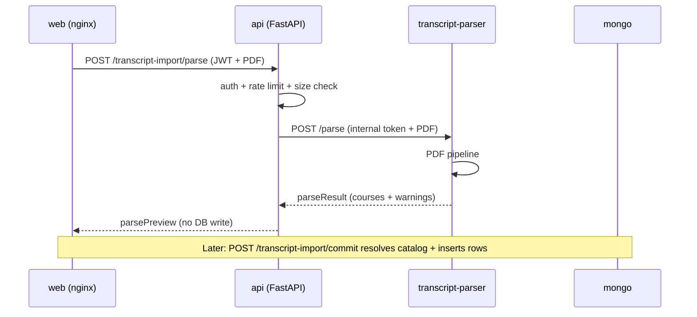

# Transcript PDF Import Plan

Last updated: 2026-06-28  
Status: **Preview + commit + web upload implemented — heuristic parsing (Stage 2)**  
Related docs: `docs/API_SPEC.md`, `docs/DOMAIN_MODEL.md`, `docs/architecture/ARCHITECTURE.md`, `services/transcript-parser/README.md`

## 1) Purpose

Allow students to upload their **official Technion transcript PDF** on `/transcript` instead of manually entering each completed course. The upload is processed by a dedicated internal service; the main API validates auth, rate limits, and (in later phases) catalog matching and persistence.

This plan covers:

1. Container and API integration (implemented)
2. PDF handling pipeline inside `transcript-parser` (staged implementation)
3. Preview → confirm → persist user flow (later phase)

## 2) Goals and non-goals

### Goals

- Separate **internal** `transcript-parser` container (not exposed to clients)
- Client uploads PDF to **API only** (`POST /transcript-import/parse`)
- API forwards PDF to parser with `X-Internal-Service-Token`
- Parser returns structured rows aligned with completed-course fields
- Rate limit transcript uploads (same abuse profile as AI endpoints)
- Do not persist raw PDFs by default

### Non-goals (initial delivery)

- Frontend upload UI (separate feature)
- Automatic MongoDB write without user review
- OCR for scanned transcripts (planned fallback)
- Registrar / SSO official sync (`source: official` bulk import)

## 3) Architecture



### Containers

| Container | Role | Client-facing |
|-----------|------|---------------|
| `api` | JWT gateway, preview endpoint, future commit/catalog resolution | Yes (only exposed backend) |
| `transcript-parser` | PDF intake, text extraction, row parsing | No |
| `mongo` | Completed courses persistence | No |

Network: both services on `unipilot-internal`. Only `api` and `web` publish host ports.

### Implemented endpoints

| Service | Method | Path | Auth |
|---------|--------|------|------|
| `api` | `POST` | `/transcript-import/parse` | JWT |
| `transcript-parser` | `POST` | `/parse` | `X-Internal-Service-Token` |
| `transcript-parser` | `GET` | `/health` | none |

Environment variables: see `.env.example` (`TRANSCRIPT_PARSER_*`, `TRANSCRIPT_IMPORT_*`).

## 4) Target output contract

The parser returns a **preview DTO** consumed by the API (and eventually the web UI):

```json
{
  "courses": [
    {
      "courseNumber": "00960401",
      "semesterCode": "2024-1",
      "grade": 85,
      "creditsEarned": 3,
      "attempt": 1,
      "title": "Introduction to Data Science",
      "confidence": 0.92,
      "warnings": []
    }
  ],
  "studentId": "123456789",
  "studentName": "Student Name",
  "warnings": ["Semester heading inferred from section title"],
  "parseMetadata": {
    "pageCount": 4,
    "extractor": "pymupdf-text",
    "pipelineVersion": "0.1.0-stub",
    "textCharCount": 8420,
    "ocrUsed": false
  }
}
```

Field alignment with `completed_courses`:

| Parser field | Completed course field | Notes |
|--------------|------------------------|-------|
| `courseNumber` | resolved → `courseId` | API maps 8-digit number to catalog `courses._id` |
| `semesterCode` | `semesterCode` | `YYYY-1` winter, `YYYY-2` spring, `YYYY-3` summer |
| `grade` | `grade` | Technion numeric 0–100 |
| `creditsEarned` | `creditsEarned` | 0.5 increments, max 36 |
| `attempt` | `attempt` | default 1 |
| — | `source` | `imported` on commit (not `manual`) |
| `confidence` / `warnings` | `metadata` | stored for audit / UI review |

Records with `source: imported` or `official` remain read-only via existing `PUT`/`DELETE` rules.

## 5) PDF handling pipeline (inside `transcript-parser`)

Implementation lives under `services/transcript-parser/app/services/`. Current version: **Stage 2 — official Technion block parser** (`technion_official_parser.py`) with Hebrew and English layout support.

### Supported transcript formats

| Format | Example source | Layout |
|--------|----------------|--------|
| English official transcript | `תדפיס (1).pdf` | Column blocks: course number → title (multi-line) → credits → grade → `YYYY-YYYY Winter/Spring` |
| Hebrew official transcript | `תדפיס.pdf` | Same logical columns with RTL text; credits may appear at end of Hebrew title line |
| Simple line-oriented (fallback) | Synthetic / legacy | `YYYY-1` heading + single-line rows (previous heuristic parser) |

Reference fixtures (extracted text, committed for CI):

- `services/transcript-parser/tests/fixtures/technion_transcript_en.txt`
- `services/transcript-parser/tests/fixtures/technion_transcript_he.txt`

Sample PDFs at repo root (`תדפיס.pdf`, `תדפיס (1).pdf`) are used for local/manual verification when present.

### Stage 1 — Intake and validation (implemented)

**Module:** `pdf_intake.py`, `routes/parse.py`

1. Reject non-PDF (`%PDF-` magic bytes)
2. Enforce `MAX_UPLOAD_BYTES` (default 5 MiB)
3. Require internal service token when configured
4. Read bytes into memory (no disk persistence)

**Security:**

- No shell execution on uploaded content
- Fail fast on malformed PDF structure
- Generic 422 on unexpected parse failures (no stack traces to clients)

### Stage 2 — Text extraction (partially implemented)

**Module:** `pdf_pipeline.py` → `extract_pdf_text()`

**Primary extractor:** PyMuPDF (`fitz`) text mode — fast for text-based Technion PDFs.

Steps:

1. Open PDF from bytes stream
2. Iterate pages; collect plain text per page
3. Record `pageCount`, `textCharCount`, `extractor`, `pipelineVersion`
4. If `textCharCount == 0`, add warning: OCR fallback may be required

**Alternatives / upgrades:**

| Tool | When to use |
|------|-------------|
| `pymupdf` (current) | Default text extraction |
| `pdfplumber` | Table-aware layout, column boundaries |
| Tesseract OCR | Scanned/image-only PDFs (`ocrUsed: true`) |

### Stage 3 — Document classification

**Module (planned):** `services/transcript_parser_format.py`

Detect whether the PDF matches known Technion transcript layouts:

- Header markers (Hebrew/English): student name, ID, faculty, program
- Section headers by semester / academic year
- Grade table column headers (course number, name, credits, grade)

Output: `TranscriptFormatProfile` (template id + confidence). Unknown layouts return global warning and lower per-row confidence.

### Stage 4 — Layout and table reconstruction

**Module (planned):** `table_extraction.py`

Technion transcripts are typically **tabular** with RTL Hebrew. Approach:

1. **Text-line parsing** (first pass): regex on normalized lines
   - Course number: `\b0\d{7}\b` (8 digits, leading zero)
   - Grade: integer/float 0–100
   - Credits: `\d+(\.\d)?` in 0.5 steps
2. **Table pass** (second pass): use `pdfplumber` or PyMuPDF blocks with bounding boxes
   - Cluster text blocks into rows by Y coordinate
   - Order columns by X (RTL: grade column may appear left of course number)
3. **Semester context**: attach rows to nearest preceding semester heading
   - Patterns: `2024-2025 סמסטר א`, `Winter 2024`, `2024-1`

Hebrew RTL post-processing reuse: adapt patterns from `services/data-engineering/app/utils/hebrew_rtl.py` (bidirectional marks, digit order).

### Stage 5 — Row normalization

**Module (planned):** `row_normalizer.py`

For each raw row:

| Field | Rules |
|-------|-------|
| `courseNumber` | Left-pad to 8 digits; strip spaces |
| `semesterCode` | Map Technion term labels → `YYYY-1/2/3` |
| `grade` | Parse numeric; reject if out of range |
| `creditsEarned` | Round to nearest 0.5; validate ≤ 36 |
| `attempt` | Default 1; detect "מועד ב" / second attempt markers |
| `title` | Optional; strip RTL artifacts |
| `confidence` | Weighted score from regex match + column alignment + semester context |

Emit per-row `warnings` (e.g. `"Grade missing — row skipped"`, `"Ambiguous semester"`).

### Stage 6 — Response assembly

**Module:** `pdf_pipeline.py` → `parse_technion_transcript_pdf()`

1. Merge header fields → `studentId`, `studentName`
2. Deduplicate rows (same course + semester + attempt)
3. Sort by semester descending
4. Aggregate global `warnings`
5. Return `ParseTranscriptResult` Pydantic model

**Current stub behavior:** Production parser extracts all course blocks from official Hebrew/English Technion transcripts (`pipelineVersion` `0.3.0-official-he-en`). Simple single-line transcripts still use the legacy fallback parser.

### Stage 7 — OCR fallback (future)

Trigger when `textCharCount == 0` or classification confidence low:

1. Render pages to images (PyMuPDF `get_pixmap`)
2. OCR with Tesseract (`heb+eng`)
3. Re-run Stages 3–6 on OCR text
4. Set `parseMetadata.ocrUsed = true` and reduce default confidence cap

Keep OCR **opt-in** in Docker (extra deps + CPU cost); document in compose profile if needed.

## 6) API responsibilities (outside parser)

The parser is **catalog-agnostic**. The API handles:

| Step | Owner | Description |
|------|-------|-------------|
| Auth | `api` | JWT on `/transcript-import/*` |
| Rate limit | `api` | Redis-backed per-user limits |
| Catalog resolution | `api` (future `/commit`) | Map `courseNumber` → `courseId`; flag unknown courses |
| Persistence | `api` (future `/commit`) | Bulk insert with `source: imported` |
| Conflict policy | `api` | Skip or merge duplicates `(userId, courseId, attempt)` |

### Planned commit flow

```
POST /transcript-import/parse   → preview (implemented)
POST /transcript-import/commit  → accept subset of preview rows → MongoDB
```

Commit request body (planned): list of selected row indices or full row payloads with user edits.

## 7) Error handling matrix

| Condition | Parser HTTP | API HTTP | User message |
|-----------|-------------|----------|--------------|
| Not PDF | 400 | 400 | Must upload PDF |
| Too large | 400 | 400 | File too large |
| Invalid PDF structure | 422 | 422 | Unable to read transcript |
| No text / OCR needed | 200 + warnings | 200 + warnings | Preview with warning banner |
| Internal token missing/wrong | 401 | 502/401 | Generic failure |
| Parser unreachable | — | 503 | Service temporarily unavailable |

## 8) Testing strategy

### `transcript-parser`

- Unit: intake validation, text extraction, pipeline metadata
- Fixture PDFs: synthetic PyMuPDF docs + anonymized real samples (gitignored under `tests/fixtures/transcripts/`)
- Target: 100% coverage (project standard)

### `api`

- Unit: HTTP client mock
- Integration: `/transcript-import/parse` with mocked parser
- Security: JWT required, rate limit 429
- Future: commit flow, catalog mismatch, duplicate handling

### E2E (later)

Upload PDF on `/transcript` → review table → confirm → rows appear with `source: imported`.

## 9) Implementation phases

| Phase | Scope | Status |
|-------|-------|--------|
| A | `transcript-parser` container + health + stub parse | **Done** |
| B | API proxy `/transcript-import/parse` + rate limit | **Done** |
| C | Table/row heuristics for Technion PDF layout (HE + EN) | **Done** |
| D | API `/transcript-import/commit` + catalog resolution | **Done** |
| E | Web upload UI + preview/confirm on `/transcript` | **Done** |
| F | OCR fallback + confidence tuning | Planned |

## 10) Risks and mitigations

| Risk | Impact | Mitigation |
|------|--------|------------|
| Hebrew RTL garbles column order | Wrong grades/courses | Table-aware extraction + confidence + user review before commit |
| Transcript layout changes | Parser breaks | Format profiles + versioned `pipelineVersion` |
| Scanned PDFs | Empty text extraction | OCR fallback stage |
| PII in uploaded PDFs | Privacy | No raw PDF persistence; short-lived memory only |
| Catalog course not found | Incomplete import | Preview flags unresolved rows; user can fix manually |
| Duplicate manual + imported rows | Data conflict | Commit policy: skip duplicates or prefer imported |

## 11) File map

```text
services/transcript-parser/
  app/
    routes/parse.py           # POST /parse
    services/pdf_intake.py     # validation
    services/pdf_pipeline.py  # extraction + orchestration
    services/technion_official_parser.py  # Hebrew/English official transcript blocks
    services/text_line_parser.py  # fallback simple-line parser
    schemas/parse_result.py   # output contract
services/api/
  app/routes/transcript_import.py
  app/clients/transcript_parser_client.py
  app/schemas/transcript_import.py
docker-compose.yml            # transcript-parser service (internal)
docs/planning/TRANSCRIPT_PDF_IMPORT_PLAN.md
```

## 12) Next steps

1. Collect 3–5 anonymized official Technion transcript PDF samples (gitignored) for fixture tests
2. Implement Stage 3–5 row parsing against real layouts
3. Add `POST /transcript-import/commit` with catalog resolution
4. Build web upload + preview UI on `TranscriptPage`
